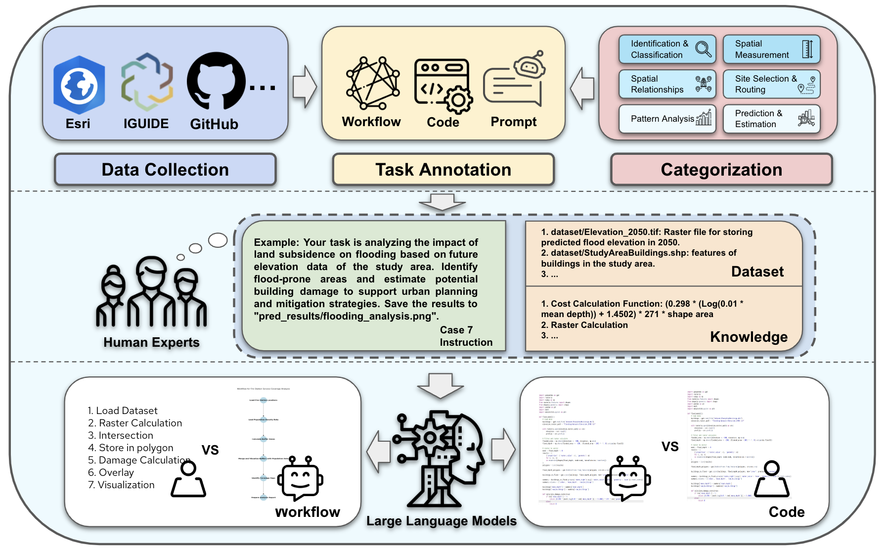

# GeoAnalystBench
GeoAnalystBench: A GeoAI benchmark for assessing large language models for spatial analysis workflow and code generation

## Automating GIS Workflows with Large Language Models (LLMs)

Recent advances in Geospatial Artificial Intelligence (GeoAI) have been driven by generative AI and foundation models. While powerful geoprocessing tools are widely available in Geographic Information Systems (GIS), automating these workflows using AI-driven Python scripting remains a challenge, especially for non-expert users.

This project explores the capabilities of Large Language Models (LLMs) such as ChatGPT, Claude, Gemini, Llama, and DeepSeek in automating GIS workflows. We introduce a benchmark of 50 geoprocessing tasks to evaluate these models' ability to generate Python functions from natural language instructions.

Our findings reveal that proprietary LLMs achieve higher success rates (>90%) and produce workflows more aligned with human-designed implementations than open-source models. The results suggest that integrating proprietary LLMs with ArcPy is a more effective approach for specialized GIS workflows.

By providing benchmarks and insights, this study contributes to the development of optimized prompting strategies, future GIS automation tools, and hybrid GeoAI workflows that combine LLMs with human expertise.

## Key Features:
- **Benchmark for GIS Automation**: Evaluation of LLMs on 50 geoprocessing tasks.
- **LLM Performance Comparison**: Validity and similarity analysis of generated workflows.
- **Python & ArcPy Integration**: Assessing LLM suitability for GIS scripting.
- **Open-source Versus Proprietary Models**: Comparison of performance and reliability.

## Tasks

  
Click to see dataset details

    | ID | Task Name | Source |
    |----|-----------|--------|
    | 1  | Find heat islands and at-risk populations in Madison, Wisconsin | [Link]() |
    | 2  | Find future bus stop locations in Hamilton | [Link]() |
    | 3  | Assess burn scars and wildfire impact in Montana using satellite imagery | [Link]() |
    | 4  | Identify groundwater vulnerable areas that need protection | [Link]() |
    | 5  | Visualize data on children with elevated blood lead levels while protecting privacy | [Link]() |
    | 6  | Use animal GPS tracks to model home range and movement over time | [Link]() |
    | 7  | Analyze the impacts of land subsidence on flooding | [Link]() |
    | 8  | Find gaps in Toronto fire station service coverage | [Link]() |
    | 9  | Find the deforestation rate for Rondônia | [Link]() |
    | 10 | Analyze the impact of proposed roads on the local environment | [Link]() |
    | 11 | Create charts in Python to explore coral and sponge distribution around Catalina Island | [Link]() |
    | 12 | Find optimal corridors to connect dwindling mountain lion populations | [Link]() |
    | 13 | Understand the relationship between ocean temperature and salinity at various depths in the South Atlantic Ocean | [Link]() |
    | 14 | Detect persistent periods of high temperature over the past 240 years | [Link]() |
    | 15 | Understand the geographical distribution of Total Electron Content (TEC) in the ionosphere | [Link]() |
    | 16 | Analyze climate change trends in North America using spatiotemporal data | [Link]() |
    | 17 | Analyze the geographical distribution of fatal car crashes in New York City during 2016 | [Link]() |
    | 18 | Analyze street tree species data in San Francisco | [Link]() |
    | 19 | Model spatial patterns of water quality | [Link]() |
    | 20 | Predict the likelihood of tin-tungsten deposits in Tasmania | [Link]() |
    | 21 | Find optimal corridors to connect dwindling mountain lion populations(2) | [Link]() |
    | 22 | Find optimal corridors to connect dwindling mountain lion populations(3) | [Link]() |
    | 23 | Assess Open Space to Lower Flood Insurance Cost | [Link]() |
    | 24 | Provide a de-identified point-level dataset that includes all the variables of interest for each child, as well as their general location | [Link]() |
    | 25 | Create risk maps for transmission, susceptibility, and resource scarcity. Then create a map of risk profiles to help pinpoint targeted intervention areas | [Link]() |

The dataset for each task is avaliable to download in our lab
website:

## Case Study 1

## Case Study 2

## Reference

